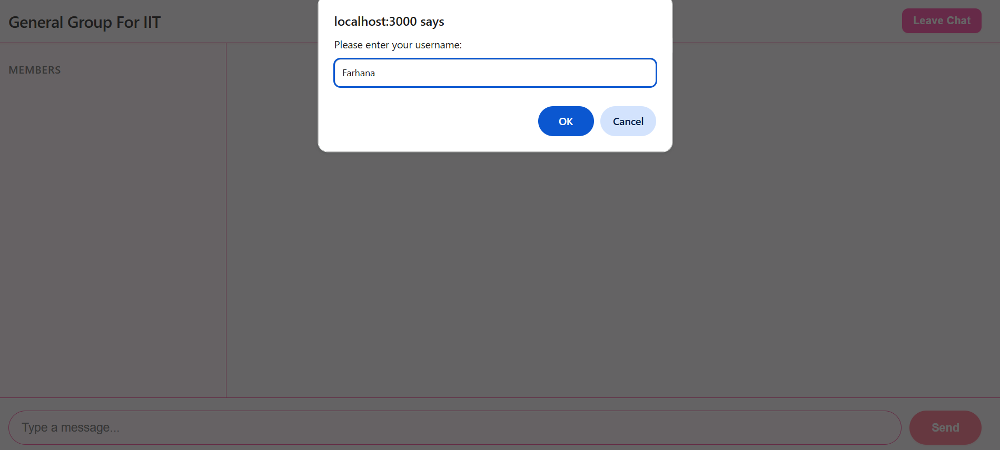
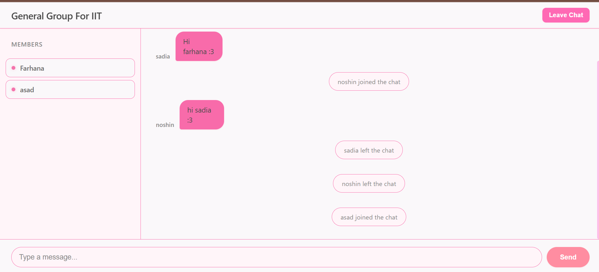
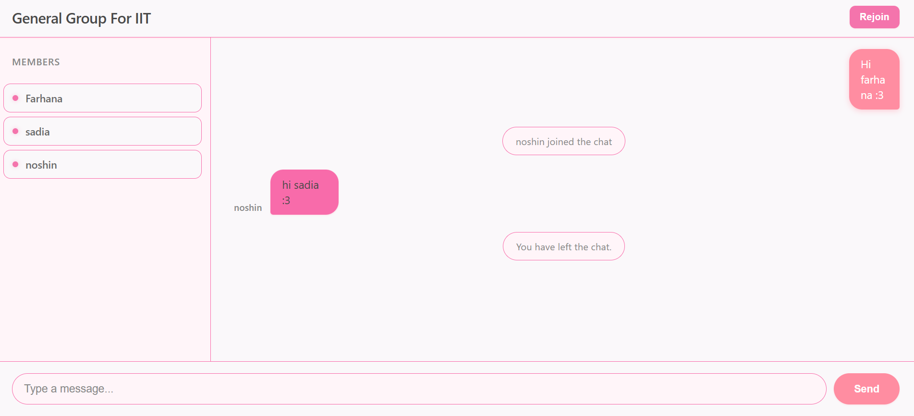

# ChatBox
A **real-time chatbox application** built with modern web technologies — simple, responsive, and fun to use! 

---

##  About

**ChatBox** is a real-time messaging app where users can join chat rooms and communicate instantly.  
Perfect for learning WebSockets and building interactive online apps.

---

##  Features

✨ Real-time messaging  
✨ Multiple chat rooms  
✨ Responsive UI  
✨ Easy to customize

---

##  Tech Stack

| Technology | Usage |
|------------|-------|
| 🟦 Node.js  | Backend server |
| 📡 Socket.IO | Real-time communication |
| 📃 Express  | API & routing |
| 💻 HTML/CSS/JS | Frontend UI |


---


## 📸 Application Preview

### 🏠 Chat Interface

*Main chat screen where users can join and send messages instantly.*

---

### 💬 Sending Messages

*User typing and sending a message in a chat room.*

---

### 🏷️ Joining a Chat Room

*Users can enter their name and join different chat rooms.*

---


### 🚪 Leaving the Chat

*Displays a system notification when a user leaves the chat room.*

---

### 😊 Emoji Messages

*Users can send fun emoji messages to make conversations more interactive and expressive.*

---

### 👥 Group Messaging

*Multiple users chatting together in a shared group room with real-time message updates.*

---

##  Installation

###  Prerequisites

Make sure you have **Node.js** installed:

```bash
node -v
npm -v

---
